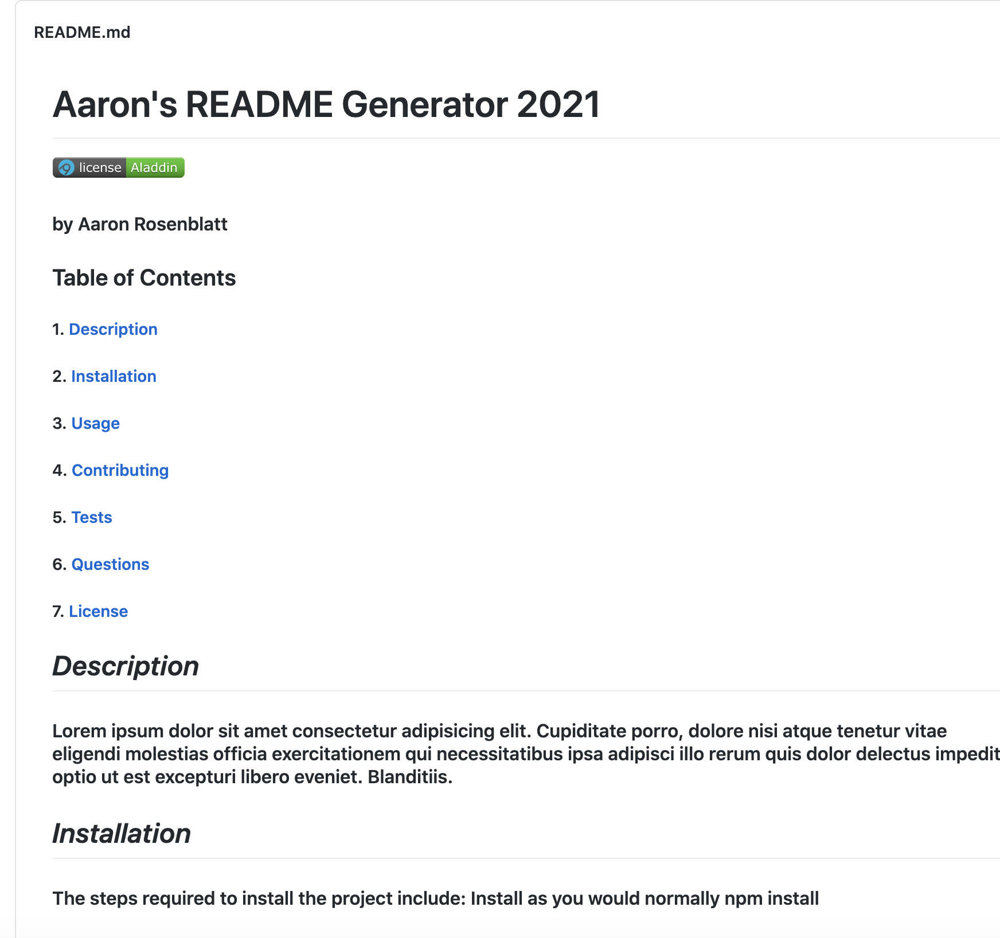
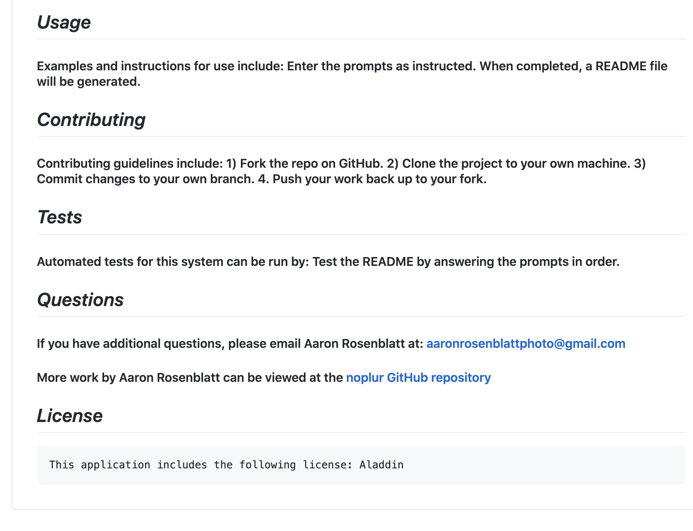

# Stunning README Maker
## by Aaron Rosenblatt
#### I wrote Node.js commands combined with JavaScript to make a professional README generator. When the command "node index.js" is entered into Terminal, a series of prompts appears for the user to answer. The command-line application then incorporates the responses to make the high-quality README so the user can spend more time working on their project. The README will include the project title, the user's name, and the following sections: Description, Table of Contents, Installation, Usage, License, Contributing, Tests, and Questions. When a description, installation instructions, contribution guidelines, and test instructions are entered in the command-line, the information will be added to the corresponding section of the README. The user can also choose a license for the application from a list of options. The badge for that license will be displayed towards the top of the README and a section titled License will explain which license the application is covered under. A Questions section will provide the user's GitHub username with a link to that Github profile and an email address so the user can reach the project maker with further questions. The GitHub username, GitHub profile link and the email address will be provided in the command-line. Finally, when the user clicks on a link in the Table of Contents the user will be taken to that section. 

#### To use this README maker, clone the [README maker repository](https://github.com/noplur/Stunning-Readme-Maker), use Terminal to go to the README maker's root directory and enter "node index.js" and follow the prompts.  

### The GitHub repository for the Stunning README Maker can be viewed here: https://github.com/noplur/Stunning-Readme-Maker

### The Stunning README Maker walkthrough video can be viewed here: https://drive.google.com/file/d/1y8Hv-qFl89nngVw-nlNeZJfG1eSdygb_/preview

### Here are a few screenshots of a sample README using the The Stunning README Maker:
### 
### 